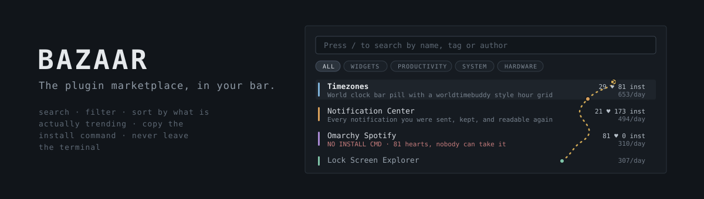
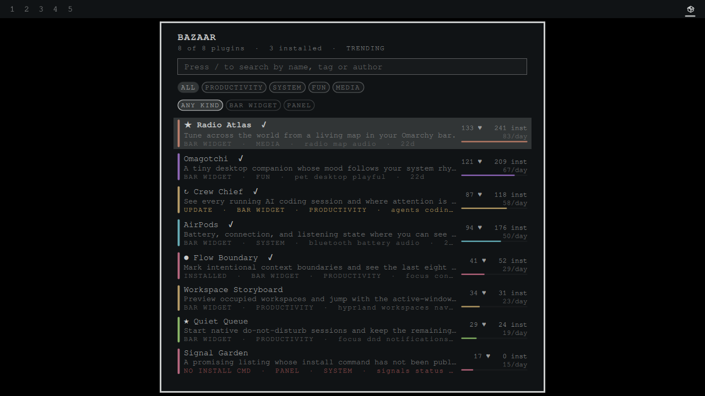

<p align="center"></p>

# Bazaar

The plugin marketplace, in your bar. Search every listing, filter by category,
sort by what is actually trending, and copy an install command without opening a
browser.



You are in a terminal. You want a clipboard widget, or a VPN indicator, or
something you cannot name yet. The marketplace is a website, so finding out
means leaving what you were doing, loading a page, scrolling, and coming back.

Bazaar puts the whole catalog behind one key. Type a few letters, get the
matches ranked, press enter, and the install command is on your clipboard. The
pill counts what has been listed since you last looked and shows nothing when
you are caught up.

[](https://ko-fi.com/U5S225PTME)

## Trending means views per day, not a running total

Hearts, installs and views are cumulative counters. Ranking on them returns
whatever has been listed longest and calls it popular, which is why the same
handful of plugins sit at the top of every "most hearted" list forever.

The catalog records when each plugin was listed, so Bazaar divides: views per
day since listing. That is the only figure here that distinguishes *what is hot
right now* from *what has been around longest*, and it costs one division.

Sort by trending, hearts, installs, views, GitHub stars, newest, or name.
Whatever you choose, the bar under each row shows relative magnitude, scaled to
the 90th percentile rather than the maximum so one runaway listing does not
flatten everything else into an invisible sliver.

## It tells you when a plugin cannot be installed

The marketplace publishes, for every listing, whether an install command exists.
Bazaar reads that flag and marks the ones that have none.

This is not a rare edge case. Some popular listings require manual setup because
the marketplace has no install command for them. Bazaar shows you that before
you spend time on a listing rather than after.

## A shortlist the website cannot give you

Marketplace hearts are anonymous aggregates by design: the engagement service
stores no accounts, no cookies and no browser identifiers. That is a good
privacy decision, and it means there is no "plugins I hearted" to fetch back.

Bazaar keeps a saved list locally instead. Press `s` to save, `a` to show only
saved. It lives in your own state directory, it is yours, and it is the one
feature here that a website structurally cannot offer.

## Keys

| Key | Action |
| --- | --- |
| `/` | search by name, description, tag or author |
| `j` `k` or arrows | move |
| `enter` | copy the install command |
| `o` | open the repository |
| `s` | save or unsave |
| `a` | show only saved |
| `t` | cycle sort |
| `c` | clear search and filters |
| `r` | refresh now |
| `esc` | close |

Category filters are pills you can click. Left-click a row copies its install
command; right-click opens its repository.

## Install

Copy the plugin into your Omarchy plugins directory and enable it in the bar:

```bash
git clone https://github.com/jeremylongshore/omarchy-bazaar-entry.git \
  ~/.config/omarchy/plugins/bazaar
```

Then add `io.github.jeremylongshore.bazaar` to your bar layout in
`~/.config/omarchy/shell.json`, or enable it from the Omarchy settings UI.

To remove it, delete that directory, drop the entry from your bar layout, and
optionally `rm -rf ~/.local/state/omarchy/bazaar` to clear the cache and your
saved list.

## Settings

| Setting | Default | What it does |
| --- | --- | --- |
| Default sort | Trending | which ranking the panel opens on |
| Count new listings on the pill | On | show how many plugins appeared since you last looked |
| Flag listings nobody can install | On | mark plugins whose install command is missing |
| Desktop notifications | Off | notify when new plugins are listed |

## How it works

No node, no python, no external runtime. A stock Omarchy install has no node on
the graphical session PATH, so the whole plugin is Quickshell plus the curl your
box already ships. Parsing lives in a pure `Model.js` that loads unchanged in
the shell and in node, which is how the offline suite covers it.

Two sources, refreshed on different cadences because they cost different
amounts:

| Source | Size | Cadence |
| --- | --- | --- |
| `omarchyplugins.com/catalog.json` | 245 KB gzipped | every 6 hours, conditionally |
| `api.omarchyplugins.com/v1/stats` | 15 KB gzipped | every 30 minutes |

The catalog carries an `ETag`, so an unchanged catalog answers `304` with no
body at all. Both are cached under `~/.local/state/omarchy/bazaar/` through
`FileView` with atomic writes, so a killed shell never leaves half a file. The
panel refreshes on open when the cache is stale, and is idle otherwise.

Neither request is authenticated and neither carries anything about you. Bazaar
only reads.

## Safety

Every listing is written by a third party, so all of it is treated as untrusted
input. Names, descriptions, tags and authors render as `PlainText`, width-bound
and elided, so a long or hostile name cannot push a row or shove the stats off
the panel.

The install command is the one string that reaches your clipboard, and it is
refused outright if it contains a newline, because a newline in a pasted command
runs a second command. It reaches `wl-copy` on stdin rather than through a
shell, so there is nothing to quote and nothing to escape.

Repository links are opened only when they match `https://github.com/...`.

## Tests

```bash
npm test
```

The suite runs against real catalog and stats payloads captured from the live
marketplace, never the network.

## Maintainers wanted

These plugins are growing, and we are looking for dependable Omarchy users who
want to review issues, test releases, and keep a plugin healthy over time. Start
with a small pull request or [open a maintainer interest issue](https://github.com/jeremylongshore/omarchy-bazaar-entry/issues/new?template=maintainer_interest.md&title=Maintainer%20interest%3A%20)
titled **Maintainer interest**. Tell us which plugin you use and how you want to
help. Consistent contributors can earn maintainer responsibility.

## License

MIT. See [LICENSE](LICENSE).
